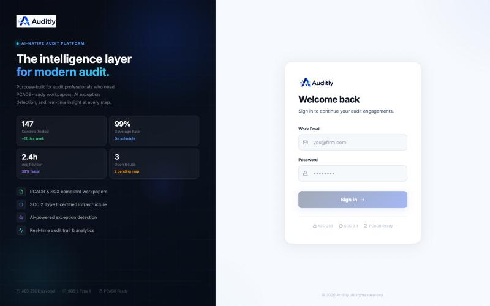

<p align="center"></p>

# Auditly

AI-assisted IT audit and SOX compliance workspace, built by an auditor for auditors.

Auditly covers the full engagement lifecycle (scoping, PBC requests, control testing,
exceptions and deficiency assessment) and uses AI to check evidence, draft
workpapers and flag issues. The output is a Big 4-style Excel workpaper.



## Features

- **Engagements & controls**: ITGC (change management, access, operations, development) and ITAC controls
- **PBC tracker**: a 3-step request → receive → review workflow, with an AI check on each evidence item
- **Client portal**: clients upload evidence through tokenised links, with no account needed
- **Workpapers**: test procedures, sampling, annotated screenshots and Excel export
- **IPE register**: tracks the completeness and accuracy of system reports
- **Exceptions & deficiency assessment**: classifies issues as deficiency, significant deficiency or material weakness
- **Segregation of duties analysis**: detects conflicts in user access listings
- **Audit trail, SSO (Google / OneDrive), S3 file storage and 2FA**

## Stack

React + Vite · tRPC · Node (tsx) · Drizzle ORM + MySQL · Anthropic Claude API · AWS S3

## Quick start

```bash
cp .env.example .env    # set DATABASE_URL, JWT_SECRET, ANTHROPIC_API_KEY
npm install
npm run db:push
npm run dev             # API + UI
```

On first start, Auditly seeds a demo engagement for a fictional company, "Acme Corp FY2024".
It also creates an admin account. Set `ADMIN_EMAIL` / `ADMIN_PASSWORD` in `.env`, or
use the one-time password printed in the server log. You must change it on first login.

## Status

This is an early-stage personal project and is not production-hardened. Issues and PRs are welcome.

## License

[MIT](LICENSE)
